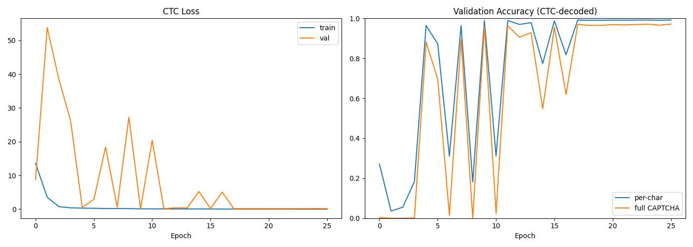
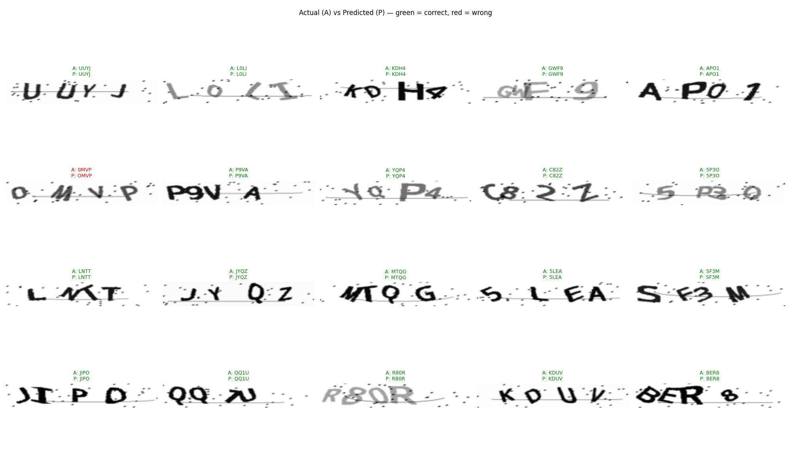

# BreakCAPTCHA

A CNN-based CAPTCHA solver that generates synthetic training data, preprocesses images with OpenCV, trains a character classifier with TensorFlow/Keras, and deploys as a Chrome browser extension using TensorFlow.js for client-side inference.

---

## Overview

BreakCAPTCHA targets standard 4-character alphanumeric CAPTCHAs (A–Z, 0–9). It treats CAPTCHA solving as a sequence recognition problem: the full image is fed to a CRNN (convolutional layers followed by bidirectional LSTMs) and trained end-to-end with CTC loss, which aligns the model's per-column output to the 4-character label without any explicit segmentation. The trained model is exported to TensorFlow.js and bundled inside a Chrome extension that auto-detects and solves CAPTCHAs on any webpage.

On a held-out set of 10,000 synthetic CAPTCHAs, the model reaches **97.05% full-string accuracy** and **99.18% per-character accuracy** (see [Results](#results)).

---

## Architecture

```
Raw CAPTCHA image (200x80 px)
        │
        ▼
[ Preprocessing ]
  Resize to 32x200 → Grayscale → Normalize to [0,1]
  (no thresholding — the network sees the full grayscale image)
        │
        ▼ (1 image, 32x200x1)
[ CRNN + CTC ]
  Conv(64) → Conv(128) → Conv(256) → Conv(256)   (pool height, keep width)
  → Reshape to 50 timesteps × 512 features
  → BiLSTM(128) → BiLSTM(128)
  → Dense(37, softmax)   (36 classes + 1 CTC blank)
  → Greedy CTC decode
        │
        ▼
[ Predicted text ] → Auto-filled into CAPTCHA input field
```

---

## Project Structure

```
BreakCAPTCHA/
├── data/
│   ├── generate_captchas.py      # Phase 1: synthetic CAPTCHA generator
│   └── dataset/                  # Generated images (gitignored)
├── preprocessing/
│   └── preprocess.py             # Phase 2: resize / grayscale / normalize pipeline
├── model/
│   ├── model_architecture.py     # CRNN definition
│   ├── train.py                  # Phase 3: training script
│   └── evaluate.py               # Evaluation and metrics
├── export/
│   └── convert_to_tfjs.py        # Phase 4: Keras → TF.js conversion
├── extension/
│   ├── manifest.json             # Chrome Manifest V3
│   ├── content.js                # CAPTCHA detection + solving
│   ├── background.js             # Service worker
│   ├── popup.html / popup.js     # Toggle UI
│   ├── preprocessing.js          # Browser-side image preprocessing
│   ├── solver.js                 # TF.js model loading + inference
│   ├── lib/                      # Bundled TF.js (tf.min.js)
│   └── tfjs_model/               # Converted model files (gitignored)
├── requirements.txt
├── .gitignore
└── README.md
```

---

## Results

Trained on 40,000 synthetic CAPTCHAs and evaluated on a held-out 10,000-image validation set.

| Metric | Value |
|---|---|
| **Full-CAPTCHA accuracy** (all 4 chars correct) | **97.05%** (9,705 / 10,000) |
| **Per-character accuracy** | **99.18%** |
| Best epoch | 18 (early-stopped at 25, best weights restored) |
| Validation CTC loss | 0.139 |

**Per-position accuracy** is high and even across all four slots — the model has no positional weak spot:

| char 1 | char 2 | char 3 | char 4 |
|---|---|---|---|
| 99.53% | 99.08% | 99.05% | 99.06% |

### Training curves



The run tells a clear story. Training loss descends cleanly throughout, but validation **oscillates violently for the first ~16 epochs** (swinging between ~97% and near-zero) before locking in. This is a BatchNorm train/inference statistics mismatch: while the weights move fast, BatchNorm's stored moving-average statistics lag behind, so the inference path is unstable. As the learning rate steps down (`ReduceLROnPlateau`: 2e-3 → 1e-3 → 5e-4) the weight updates shrink, the statistics catch up, and from epoch ~17 onward validation is rock-steady at ~97%. (See [Future Work](#future-work) for the clean fix.)

### Error analysis — errors are concentrated and explainable

34 of the 36 character classes achieve an f1-score of **1.00**. Virtually all error comes from a single, genuinely ambiguous pair:

| Confusion | Count |
|---|---|
| `0` → `O` | 109 |
| `O` → `0` | 84 |
| every other confusion | ≤ 4 each |

The `0`↔`O` pair alone accounts for **~60% of all character-level mistakes**. Since `0` and `O` are near-identical glyphs in this font, this is close to the irreducible error floor — there is little signal in the image to separate them without surrounding context.

### Sample predictions



*Actual (A) vs Predicted (P) — green = correct, red = wrong. The wrong example is a `0`→`O` substitution, consistent with the error analysis above.*

---

## Setup

**Requirements:** Python 3.11, pip, Google Chrome

```bash
# Clone the repository
git clone https://github.com/madhavseth512/BreakCAPTCHA.git
cd BreakCAPTCHA

# Create and activate virtual environment
py -3.11 -m venv venv
venv\Scripts\activate          # Windows
# source venv/bin/activate     # Linux / macOS

# Install dependencies
pip install -r requirements.txt
```

> **Note:** TensorFlow 2.15 on native Windows runs on CPU only. GPU training requires WSL2. For this model size (~300K parameters, ~40K samples), CPU training completes in under 15 minutes.

---

## Usage

Run each phase in order from the project root with the virtual environment active.

### Phase 1 — Generate Training Data

```bash
python -m data.generate_captchas
```

Generates 10,000 synthetic CAPTCHA images into `data/dataset/`. Labels are embedded in filenames (`ABCD_00001.png`).

Options:
```
--count   Number of images to generate  (default: 10000)
--seed    Random seed                   (default: 42)
--output  Output directory              (default: data/dataset)
```

---

### Phase 2 — Preprocess Images

```bash
python -m preprocessing.preprocess
```

Resizes each image to 32×200, converts to grayscale, and normalizes to [0,1] — no thresholding or segmentation. Saves whole-image arrays (`X_*.npy`), integer label sequences (`y_*.npy`, shape `(N, 4)`), and `char_classes.json` to `data/processed/`. Also writes `sample_check.png` (5 preprocessed images) so you can confirm glyphs are legible.

Options:
```
--input   Raw CAPTCHA directory   (default: data/dataset)
--output  Processed data output   (default: data/processed)
```

---

### Phase 3 — Train the Model

```bash
python -m model.train
```

Trains the CRNN with CTC loss and saves the best inference model (image → softmax) to `model/saved_model/captcha_model.h5`. A custom callback greedy-decodes the validation set each epoch and logs real per-character and full-CAPTCHA accuracy.

> **Validation gate — run this first.** Before a full run, confirm the pipeline is wired correctly by overfitting a tiny subset:
> ```bash
> python -m model.train --overfit 100
> ```
> It must reach ~100% full-CAPTCHA accuracy on 100 samples. If it can't memorize 100 images, the loss/decode wiring is broken — fix that before training for real.

Options:
```
--data        Processed data directory   (default: data/processed)
--output      Model output directory     (default: model/saved_model)
--epochs      Max training epochs        (default: 50)
--batch-size  Batch size                 (default: 32)
--overfit N   Overfit N samples to verify wiring, then exit (gate)
```

---

### Phase 4 — Evaluate

```bash
python -m model.evaluate
```

Reports per-character accuracy, per-CAPTCHA accuracy, per-class breakdown, and 10 sample predictions vs ground truth.

---

### Phase 5 — Export to TF.js

```bash
# Install TF.js converter (separate from main requirements)
pip install tensorflowjs==4.10.0

python -m export.convert_to_tfjs
```

Converts `captcha_model.h5` to TensorFlow.js LayersModel format and copies the output + `char_classes.json` into `extension/tfjs_model/`.

---

### Phase 6 — Load the Chrome Extension

1. Download `tf.min.js` from the [TensorFlow.js releases](https://github.com/tensorflow/tfjs/releases) and place it at `extension/lib/tf.min.js`
2. Open Chrome and navigate to `chrome://extensions`
3. Enable **Developer mode** (top-right toggle)
4. Click **Load unpacked** and select the `extension/` directory
5. The BreakCAPTCHA icon will appear in the toolbar — click it to enable/disable

---

## How It Works

### Preprocessing

Preprocessing is deliberately minimal — the CRNN learns its own features, so the goal is to preserve information, not to clean the image. Each CAPTCHA is resized to 32×200, converted to grayscale, and normalized to [0, 1]. **No thresholding or segmentation.**

Earlier versions used Otsu binarization, but the `captcha` library renders colored glyphs over noise curves: a global threshold merges glyphs with the noise and destroys the stroke detail the convolutional layers rely on. Feeding full grayscale keeps that signal intact.

The same pipeline is re-implemented in JavaScript (`preprocessing.js`) for browser-side use, matching the Python output without requiring OpenCV.js.

### Model

A CRNN: convolutional feature extractor → sequence model → CTC. The convolutions pool height aggressively but keep the width as a 50-step time axis, so the bidirectional LSTMs read the image left-to-right and CTC aligns that 50-step sequence to the 4-character label.

| Layer | Output Shape | Notes |
|---|---|---|
| Conv2D(64, 3×3) + BN + ReLU + MaxPool(2,2) | 16×100×64 | Edges and strokes |
| Conv2D(128, 3×3) + BN + ReLU + MaxPool(2,2) | 8×50×128 | Letter parts |
| Conv2D(256, 3×3) + BN + ReLU + MaxPool(2,1) | 4×50×256 | Pool height only |
| Conv2D(256, 3×3) + BN + ReLU + MaxPool(2,1) | 2×50×256 | Preserve width = timesteps |
| Permute + Reshape | 50×512 | Width becomes the time axis |
| Dense(64, ReLU) | 50×64 | Feature bottleneck |
| Bidirectional LSTM(128) ×2 | 50×256 | Left-right sequence context |
| Dense(37, softmax) | 50×37 | 36 classes + 1 CTC blank |

Trained end-to-end with **CTC loss** (no per-character labels or segmentation), Adam (lr=0.002, gradient clipping), early stopping on val_loss (patience=8), and ReduceLROnPlateau. Training batches drop the final remainder so a tiny last batch can't corrupt BatchNorm's inference statistics. Inference uses greedy CTC decoding.

Why CRNN+CTC over the earlier per-character CNN: the previous design used global average pooling, which discarded all spatial layout — the per-position heads couldn't tell character 1 from character 4 and stalled near the 1/36 random baseline. The CRNN keeps the horizontal sequence intact, which is exactly what positional character recognition needs.

### Chrome Extension

The extension loads TF.js from a bundled `tf.min.js` (no CDN, works on sites with strict CSPs). When a CAPTCHA image is detected on a page, the model is lazy-loaded once and cached. The JS preprocessing pipeline resizes and normalizes the whole image, the CRNN produces a per-timestep softmax sequence, a greedy CTC decode (reimplemented in JS, since TF.js has no built-in `ctc_decode`) turns it into text, and the result is filled into the nearest CAPTCHA input field.

Character class ordering is loaded at runtime from `char_classes.json` (generated during training), not hardcoded — ensuring the extension's label mapping always matches the model exactly.

---

## Validation Gates

CTC models fail *silently*: a wiring bug (mis-encoded labels, wrong blank-token index, a transposed time axis, or a mismatched decode) doesn't crash — it just trains to garbage that looks like a "bad model." Earlier iterations of this project burned several full training runs on exactly this. To prevent that, the pipeline is instrumented with four cheap gates that must pass **before** any expensive training run. Each isolates a different failure class and runs in seconds to minutes.

| Gate | What it checks | How to run | Utility it serves |
|---|---|---|---|
| **1 — Visual** | Preprocessed glyphs are still legible (grayscale preserved, not destroyed) | inspect `data/processed/sample_check.png` after `python -m preprocessing.preprocess` | Catches preprocessing that silently destroys the signal (e.g. over-aggressive thresholding). No model can recover from ruined input. |
| **2 — Label round-trip** | `char → index → char` encoding is loss-less and aligned with filenames | automatic assert during `python -m preprocessing.preprocess` | Catches off-by-one / blank-token / class-ordering bugs in the label mapping — the most common cause of a model that "won't learn." |
| **3 — Build-time shape** | The CNN produces `TIME_STEPS` (50) ≥ label length (4), and the realized time axis matches | automatic assert in `build_model()` | Guarantees CTC always has room to align the sequence; fails loudly if a future architecture change over-pools the width. |
| **4 — Overfit 100** | The full pipeline can memorize 100 samples to ~100% accuracy | `python -m model.train --overfit 100` | The decisive end-to-end proof. If the model can't memorize 100 images, the loss/decode wiring is broken — fix that before spending a real run. This is the gate that catches what static checks can't. |

> **Workflow:** run gates 1–3 (free, part of preprocessing/build), then gate 4. Only launch the full training run after gate 4 prints `GATE 4 PASSED`. The silent bugs these gates caught are walked through in [Challenges & Debugging](#challenges--debugging).

---

## Challenges & Debugging

Reaching 97% took several dead ends. The diagnoses — not just the final architecture — are the substance of this project, so they're documented here.

**1. Four failed runs with the original architecture.** The first design segmented characters, then evolved into a multi-output CNN (one softmax head per position) fed by a `GlobalAveragePooling2D` layer. Every run plateaued at **3–5% per-character accuracy — essentially the 1/36 random baseline.** Diagnosis: global average pooling collapses all spatial information into a single vector, so each per-position head received an *identical* input and could not tell character 1 from character 4. The architecture was structurally incapable of positional recognition (and Otsu binarization was separately destroying glyph detail). → Switched to **CRNN + CTC**, which preserves the horizontal sequence and aligns it to the label without segmentation.

**2. CTC "blank collapse."** The first overfit gate failed: training loss fell to ~15 and froze while accuracy stayed at 0 — the model had collapsed to predicting the CTC blank token everywhere. To separate a *pipeline* bug from an *architecture* bug, I ran the same CTC plumbing on a deliberately simple CRNN; it failed identically, proving the wiring was sound and the problem was training dynamics. A controlled run then showed the model *could* learn (loss descended, just glacially) — so the cause was optimization speed, not a wiring error.

**3. Mini-batch instability.** Raising the learning rate to 5e-3 let the model memorize 16 samples perfectly in full-batch mode, but the 100-sample gate still bounced at a loss of ~12. Two interacting causes: a tiny final mini-batch poisoned BatchNorm's statistics, and 5e-3 was too high under mini-batch gradient noise. → Dropped the remainder batch and set `lr=2e-3`; the gate then reached **100%**.

**4. Validation oscillation during the full run.** For the first ~16 epochs, validation accuracy swung between ~97% and near-zero while training loss fell smoothly. This is a BatchNorm train/inference mismatch — fast-moving weights outran BatchNorm's moving-average statistics, so the inference path was unstable. It self-corrected as `ReduceLROnPlateau` shrank the learning rate (2e-3 → 1e-3 → 5e-4) and the statistics caught up; validation locked in at ~97% from epoch 17.

| Symptom | Root cause | Fix |
|---|---|---|
| 4 runs stuck near random (3–5%) | GlobalAveragePooling destroyed positional information | CRNN + CTC sequence model |
| Loss frozen at ~15, 0% accuracy | CTC blank collapse / too-slow convergence | higher LR; pipeline confirmed correct via control experiment |
| 100-sample gate bouncing at ~12 | tiny remainder batch corrupting BatchNorm + LR too high for mini-batch noise | drop remainder batch; `lr=2e-3` |
| Validation swinging 97%↔0% for ~16 epochs | BatchNorm inference-stat lag under fast weight movement | LR decay let stats stabilize (GroupNorm would prevent it — see Future Work) |

**What I would improve: training stability.** The recurring culprit was BatchNorm's train/inference statistics gap — it caused both the 100-sample gate bounce and the validation oscillation. Replacing BatchNorm with GroupNorm or LayerNorm (which have no moving-average statistics and behave identically in training and inference) would eliminate the instability entirely and likely allow stable training at a higher learning rate. It's the single highest-value change for a future run.

---

## Limitations

These are stated explicitly because they bound what the 97% number actually means:

1. **In-distribution accuracy only.** Training and validation data both come from the same Python `captcha` library with a single rendering style, so 97% measures how well the model learned *this generator* — not CAPTCHAs in general. There is no real-world or cross-generator test set, so true generalization is unmeasured. Against real CAPTCHAs (different fonts, colors, noise, anti-bot styling) accuracy would be **substantially lower**.
2. **Fixed 4-character length.** The character count is baked into `TIME_STEPS`, the label shape, and the decode. Variable-length CAPTCHAs would require pipeline changes (CTC itself supports them, but the current code does not).
3. **Single font / generator.** No visual diversity in the dataset, which is the main reason for the domain gap in (1).
4. **`0`/`O` ambiguity is unresolved** and dominates the error — inherent to the glyphs in this font rather than a model defect.
5. **No augmentation or regularization.** Final train loss (~0.01) is far below validation loss (~0.14) — mild overfitting. Augmentation/dropout would tighten this and improve robustness.
6. **Training was unstable.** The BatchNorm oscillation (see Results) made the run fragile — an unlucky early-stop on a "good" spike could have shipped a worse model. The final model is fine because best weights were restored, but the process needs hardening.
7. **Greedy CTC decoding**, not beam search — leaves a little accuracy on the table for ambiguous inputs.
8. **Deployment not built.** The Chrome extension and the JavaScript CTC decoder are not implemented yet, and training is CPU-only (~3.5 hrs for this run).

---

## Future Work

Concrete next steps, roughly in order of value:

- **Replace BatchNorm with GroupNorm (or LayerNorm).** These have no train/inference statistics gap, which would eliminate the validation oscillation and likely allow stable training at a higher learning rate — directly fixing the biggest process limitation.
- **Data augmentation + multiple generators/fonts.** Rotation, scaling, blur, and elastic distortion, plus CAPTCHAs from several libraries, would attack the domain gap and give a meaningful estimate of real-world generalization.
- **A real-world / cross-generator test set** to measure out-of-distribution accuracy honestly.
- **Variable-length support.** Generalize `TIME_STEPS`, labels, and decode so the model handles 4–6 character CAPTCHAs (CTC already supports this).
- **Beam-search decoding** to recover a few of the ambiguous cases greedy decoding misses.
- **Migrate `.h5` → `.keras`** to drop the legacy-format save warning.

---

## Dependencies

| Package | Version | Purpose |
|---|---|---|
| tensorflow | 2.15.0 | Model training |
| opencv-python | 4.8.1.78 | Image preprocessing |
| numpy | 1.26.4 | Array operations |
| scikit-learn | 1.4.2 | Label encoding, train/val split |
| matplotlib | 3.8.4 | Training history plots |
| captcha | 0.6.0 | Synthetic data generation |
| tensorflowjs | 4.10.0 | Model export (Phase 5 only) |

---

## License

MIT
